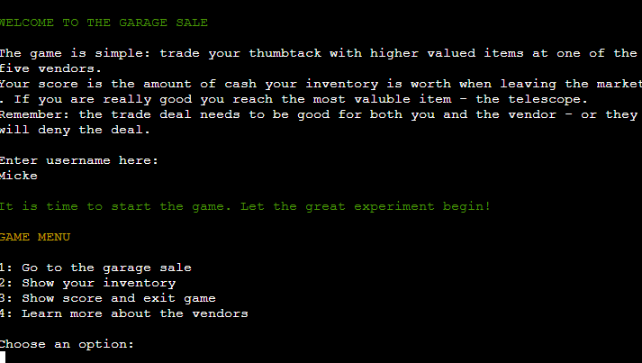

# The Garage Sale
The Garage Sale is a trading game - the user visits a garage sale and tries to
trade up from thumbtack to the highest valuble item. There are no prices at
the garage sale, the user must figure out which items the vendors are 
most likely to be willing to trade.

The game is inspired by *The Office* episode *Garage Sale*.

Find the site [**here**](https://the-garage-sale-60683b5891c9.herokuapp.com/)

## Table of Contents
* [User Experience](#user-experience)
    * [User Stories](#user-stories)

## User Experience
The Garage Sale game is a quick and in some way simple game. The user chooses itself when to finish the game. The amounts of allowed visits to the vendors is infinite but aswell as getting a higher valued item the user can leave them with a lower valued item.

### How to play
The user start with an inventory of a thumbtack. They can then choose to meet a vendor to trade that item with one of the five items the vendor possesses. If the vendor find the trade acceptable, the item changes hand. Aswell does the thumbtack. Hopefully, the users new item is more valuble than the thumbtack.

Some vendors are easier to trade with than other. Information about which to favor is available from the game menu.

When the user feels they have obtained the highest valuble item there is - they can go to the exit of the market and find out how valuble their item is. That value is their final score.
### User Stories

#### Project Goals
The goals of the project are:
* Create a game with no errors or crashes
* Deply the game in a way that it's playable when access to link is given
* Have recurring users (not measurable at the moment)

#### User Goals
As a user, I want to:
* In a clear and effective way, recieve the instructions to the game
* Play a game with no errors or crashes
* Feel the game's difficulty level is balanced
* Be able to see my final score

## Features
### Flowchart
Below is the flowchart for the application:

For readability purposes the vendor section of the flowchart has been taken out and specified in it's own flowchart. Not included in the flowchart are the big amounts of input error handling happening throughout the application.
### Existing Features
**Instructions**

The first thing the user meets are the instructions of the game. They explain the goal of the game, when and how to see the final score and also when and how to exit the game.

**Username input**

The user is asked to input a username. The username is later used for a more personal touch to the game. If the user does not provide the application with a username or inputs only blank spaces, an error message is shown and the user gets another try.

**Game menu**

The game menu stands out with it's magenta color. It's to here the user is redirected after every feature is worked through.

From the game menu you can reach:
* the vendors
* your inventory
* your score and way to exit the game
* info about the vendors

**Show inventory**

If "show inventory" option is chosen, the users inventory will displayed. Then returns the user to "Game menu".

**Show score and exit**

If "show score and exit" option is chosen, the value of the users current inventory i.e. the current score. The user is thereafter given to option to exit the game or continue playing.

**Learn more about the vendors**

If "learn more about the vendors" option is chosen, information about the five different vendors are displayed. A cunning player obtain information which of the different vendors are easy / hard to trade with. Then returns the user to "Game menu".

**Go to the garage sale**

If "Go to garage sale" option is chosen, the user is displayed with five different vendors to trade with.

**Vendors**

When meeting with the vendors, their five items are displayed and the user is asked with item they would like to trade.

**Trading**

If the vendor find the users item to be worth equal to or more then the chosen item the, trade is successful. A message is shown and the user is taken back to the game menu and can now find their new item in their inventory.

If the vendor find the users item to be worth less than the chosen item, a message is shown and the user is taken back to the game menu.

### Future Features
In the feature it would be prefferable to implement these features:
 * A quantity factor (a vendor can possess several items of the same category)
 * An online highscore, to allow the user to compare themselves to other users
 * A feature to allow the user to negotiate with or influate the vendor

## Technologies Used
### Languages
This application was created with Python version 3.12.2.
### Libraries & Tools
Colorama - to implement colors to the application.

Git - for version control

Github - to save & store files during development

Lucidchart - for flowcharts

## Deployment
### Heroku
### How to fork
### How to clone

## Credits

## Acknowledgments